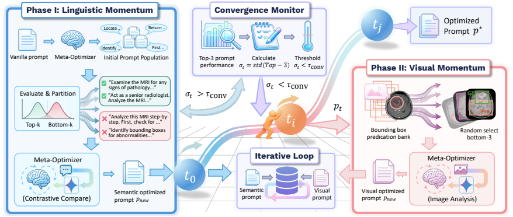

<div align="center">

# Dual-Momentum Prompt Evolution with Language and Visual Feedback for Abnormality Grounding in Rare Diseases

Jun Li · Mingxuan Liu · Jiazhen Pan · Che Liu · Elisa Ricci · Wenjia Bai · Daniel Rueckert<br>Cosmin I. Bercea · Julia A. Schnabel

An implementation of **dual-momentum prompt optimization** for abnormality grounding in medical images.

</div>

This is the official repository for the paper [**_Dual-Momentum Prompt Evolution with Language and Visual Feedback for Abnormality Grounding in Rare Diseases_**]().

<div align="center">
  
</div>

Dual-momentum optimizes prompts for a frozen large vision-language model (LVLM), without updating model weights. It alternates between two complementary optimization loops:

- **Language momentum**: compares high-performing and low-performing prompts, then asks a meta-LLM to synthesize a better prompt.
- **Visual momentum**: when language-only optimization stagnates, visualizes low-score error cases with ground-truth and predicted boxes, then asks a vision-capable meta-LLM to improve the prompt using spatial evidence.

The target task is abnormality grounding: given a medical image, the model should return bounding boxes for abnormal regions. Performance is measured by mAP@0.5.

## Repository Structure

```text
dual-momemtum-repo/
├── README.md
├── data/
│   ├── dev_nova_100.json
│   └── dev_btd_100.json
├── paper/
│   └── PaperID-3699.pdf
├── figures/
├── dual_momemtum/
│   ├── dual_momemtum.py              # Main dual-loop searcher
│   ├── dual_momemtum_config.py       # Default configuration
│   ├── run_dual_momemtum.py          # CLI entry point
│   ├── run_dual_momemtum.sh          # Batch launch script
│   ├── instructions/
│   │   ├── base.txt
│   │   └── varients/                 # Initial prompt variants
│   ├── meta_instructions/
│   │   └── phase0_init_variants.txt
│   ├── momentum/
│   │   ├── language_momemtum.py
│   │   ├── visual_momemtum.py
│   │   └── convergence_handler.py
│   ├── modules/
│   │   ├── target_model.py
│   │   ├── evaluator.py
│   │   ├── data_manager.py
│   │   ├── prompt_manager.py
│   │   └── population.py
│   └── analysis/
│       └── visualize_prompt_evolution.py
└── git_update.sh
```

## Environment

The code expects a GPU environment that can run Qwen2.5-VL through vLLM. Main Python dependencies used by the implementation include:

```bash
pip install torch transformers vllm qwen-vl-utils openai requests pillow pandas matplotlib numpy
```

Depending on your cluster or CUDA setup, install `torch` and `vllm` using the commands recommended for your system.

## Configuration

Edit `dual_momemtum/dual_momemtum_config.py` before running:

```python
'target_model_path': '/path/to/Qwen2.5-VL-3B-Instruct',
'train_data_path': 'data/dev_nova_100.json',
'dev_data_path': 'data/dev_nova_100.json',
'test_data_path': 'data/dev_nova_100.json',

'meta_llm_api_base': 'https://openrouter.ai/api/v1',
'meta_llm_model': 'your-meta-optimizer-model',
'meta_llm_api_key': 'YOUR_API_KEY',

'image_path_replacement': {
    'from': '/old/dataset/root',
    'to': '/actual/dataset/root'
}
```

Important options:

- `num_iterations`: maximum number of dual-momentum iterations.
- `batch_size`: target LVLM inference batch size.
- `dynamic_k_max`: maximum Top-K/Bottom-K comparison size.
- `convergence_threshold`: Top-3 standard deviation threshold for switching phases.
- `convergence_window`: number of consecutive plateau checks before switching.
- `visual_sub_loop_patience`: maximum visual refinement attempts per visual phase.

Avoid committing real API keys. Replace any local key in the config or launch script before sharing the repository.

## Running

Run from the implementation directory:

```bash
cd dual_momemtum
python run_dual_momemtum.py
```

Common overrides:

```bash
python run_dual_momemtum.py \
  -n 20 \
  --api-key YOUR_API_KEY \
  --model-path /path/to/Qwen2.5-VL-3B-Instruct \
  --train-data ../data/dev_nova_100.json \
  --dev-data ../data/dev_nova_100.json \
  --test-data ../data/dev_nova_100.json \
  --image-path-from /old/dataset/root \
  --image-path-to /actual/dataset/root \
  --output-dir ./output/qwen2.5-vl-3b
```

You can also use the shell wrapper:

```bash
cd dual_momemtum
bash run_dual_momemtum.sh -n 20 -k YOUR_API_KEY
```

## Outputs

By default, results are written under `dual_momemtum/dual_momemtum_results/` or the path passed through `--output-dir`.

Typical outputs include:

- `prompt_best_dual_momemtum_*.txt`: best optimized prompt.
- `meta_best_dual_momemtum_*.json`: metadata for the best prompt.
- `population_*.json`: prompt population, scores, and sources.
- `convergence_log_*.jsonl`: per-iteration convergence records.
- `convergence_report_*.json`: final convergence summary.
- `inference_results/*.jsonl`: raw model outputs and parsed boxes.
- `visualizations/*.jpg`: VisualMomemtum diagnostic overlays, with green ground-truth boxes and red predicted boxes.

Runtime logs are saved under `dual_momemtum/logs/`.

## Paper Experiments

The paper evaluates dual-momentum on two brain MRI benchmarks:

- **NOVA**: a rare disease benchmark covering 281 rare diseases.
- **BTD**: a brain tumor dataset with glioma, meningioma, and pituitary cases.

The reported setup optimizes Qwen2.5-VL Instruct models with 100 samples, uses a vision-capable meta-optimizer, and reports mAP at IoU thresholds 0.25, 0.50, and 0.75. The main result is that dual-momentum improves abnormality grounding without supervised fine-tuning, with especially strong gains on the long-tailed NOVA setting.

## Notes

- This code uses `vllm` for target model inference and OpenAI-compatible chat completion APIs for the meta-optimizer.
- VisualMomemtum requires a meta-optimizer that accepts image inputs.
- Dataset image paths must exist locally after applying `image_path_replacement`.
- The current repository does not include a `requirements.txt`; install dependencies according to your local CUDA and vLLM environment.

## Citation

If this work is useful for your research, please consider citing our paper:

```bibtex
@article{li2026dualmomentum,
  title   = {Dual-Momentum Prompt Evolution with Language and Visual Feedback for Abnormality Grounding in Rare Diseases},
  author  = {Li, Jun and Liu, Mingxuan and Pan, Jiazhen and Liu, Che and Ricci, Elisa and Bai, Wenjia and Rueckert, Daniel and Bercea, Cosmin I. and Schnabel, Julia A.},
  journal = {arXiv preprint},
  year    = {2026}
}
```
